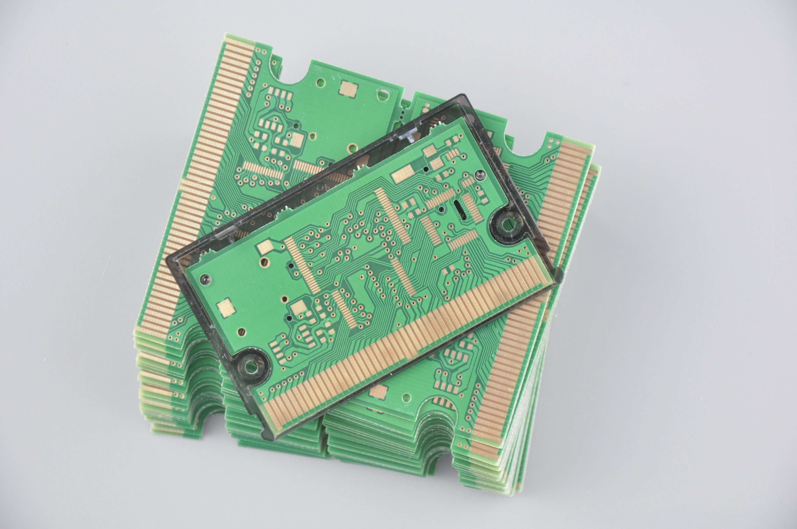

# WonderWitch Reproduction

## Schematic Capture

- [x] Create symbols
- [x] Block design

[schematic.pdf](/Schematic.pdf)

## PCB Layout

- [x] Create footprints
- [x] Route top layer 
- [x] Route bottom layer
- [x] Plane top layer
- [x] Plane bottom layer
- [x] Teardrop top layer
- [x] Teardrop bottom layer
- [ ] Silkscreen top layer

## Manufacturing Notes

- Do not plate slots and non-plated through-holes, ask fabricator to adjust keep-away. The original design was intended for electroplating and not electroless.
- Do not submit the incomplete silkscreen gerbers.

